# Oracle Multitenant Architecture – Oracle 21c Pluggable Database (PDB) Administration

## Overview
This assignment demonstrates practical skills in Oracle Multitenant Architecture including creation, management, and deletion of Pluggable Databases (PDBs), user management inside PDBs, and monitoring using Oracle Enterprise Manager (OEM).

## Task 1 Creation of a pluggable Database
 
Before creating a Pluggable Database you first check Current container and then find the Current data location which will be used in the creation of the PDB.

To check the Current container use:

```
sqlplus / as sysdba
SHOW CON_NAME;
```

 This is advised to be done everytime because it assures the user that he/she is in the correct container.

Then for finding the Current data location use:
```
SELECT name 
FROM v$datafile 
WHERE con_id = 2;
```
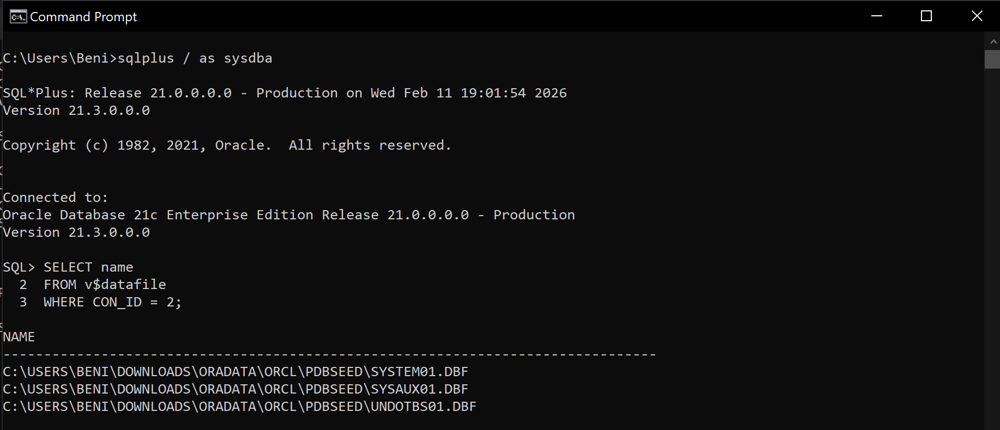

The next step is to create a PDB:

```
CREATE PLUGGABLE DATABASE se_pdb_28852
ADMIN USER pdbadmin IDENTIFIED BY 28852
FILE_NAME_CONVERT = ('C:\USERS\BENI\DOWNLOADS\ORADATA\ORCL\PDBSEED\','C:\USERS\BENI\DOWNLOADS\ORADATA\ORCL\PDBSEED\se_pdb_28852\');
```
* __CREATE PLUGGABLE DATABASE__ : creates the new PDB
* __ADMIN USER pdbadmin__ : creates an administrative user for that PDB
* __FILE_NAME_CONVERT__ : tells Oracle where to copy the datafiles from the seed database. The first path before the comma is the Old path which is the Current data location we found in the above steps and the next path is the New path which has same name as our created PDB.

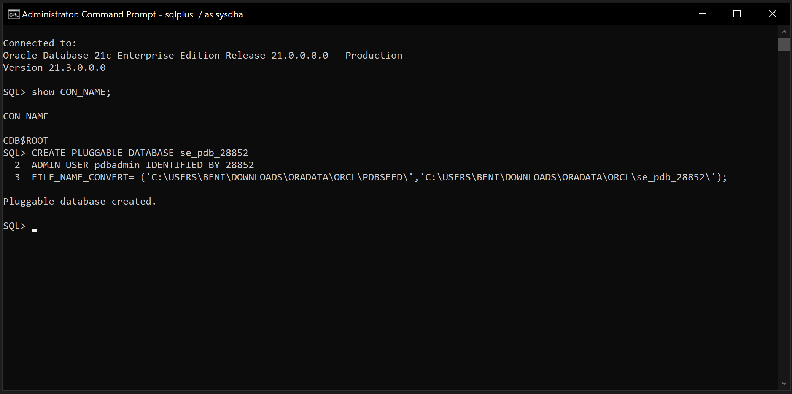

After creating the PDB OPEN it and verify that the OPEN MODE should now show READ WRITE.

```
ALTER PLUGGABLE DATABASE se_pdb_28852 OPEN;
SHOW PDBS;
```
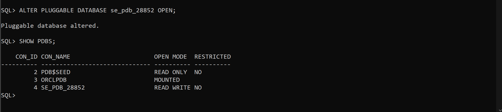

The next step is about creating a new user in our PDB.

Firstly, switch your session to the created PDB:
```
ALTER SESSION SET CONTAINER = se_pdb_28852;
```

Verify if the container has changed using
```
SHOW CON_NAME; 
```
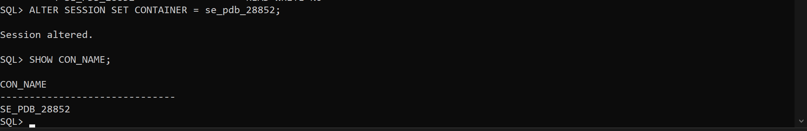

After running this you must see the name of your newly created PDB. Then create the new user and grant privileges.

```
CREATE USER user_name
IDENTIFIED BY password;

```
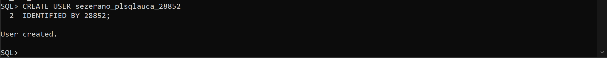
After creating a user you can grant privileges (this depends on the requirements of a given project) by running:
```
GRANT ALL PRIVILEGES TO username;
```

To verify if the user is created use:
```
SELECT username FROM dba_users
WHERE username = 'user_name'

```
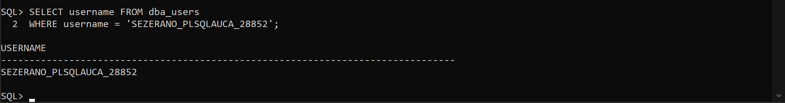

## Task 2: Creating and deleting a temporary PDB

Firstly, we must switch back to ROOT:
```
ALTER SESSION SET CONTAINER = CDB$ROOT;
SHOW CON_NAME;
```
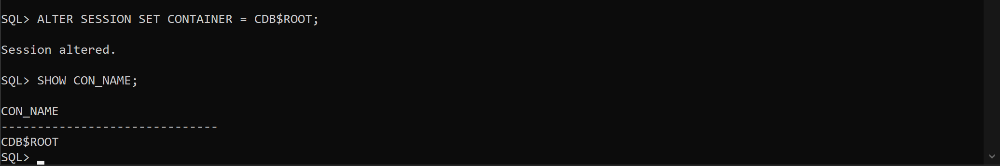

Secondly, create the Temporary PDB using:
```
CREATE PLUGGABLE DATABASE se_to_delete_pdb_28852
ADMIN USER pdbadmin IDENTIFIED BY 28852
FILE_NAME_CONVERT = ('C:\USERS\BENI\DOWNLOADS\ORADATA\ORCL\PDBSEED\','C:\USERS\BENI\DOWNLOADS\ORADATA\ORCL\PDBSEED\se_to_delete_pdb_28852\');
```
Then check if it exists using: 
```
SHOW PDBS;
```
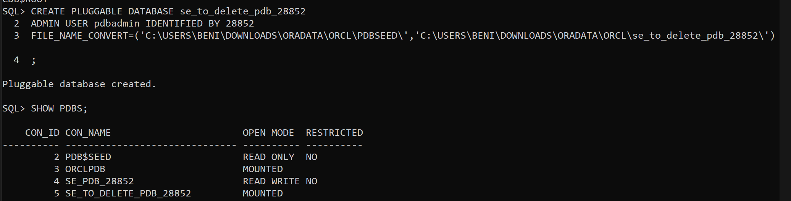

To delete the PDB we just created, run:
```
DROP PLUGGABLE DATABASE se_to_delete_pdb_28852 INCLUDING DATAFILES;
```
Then we check if the deletion was successful using:
```
SHOW PDBS;
```
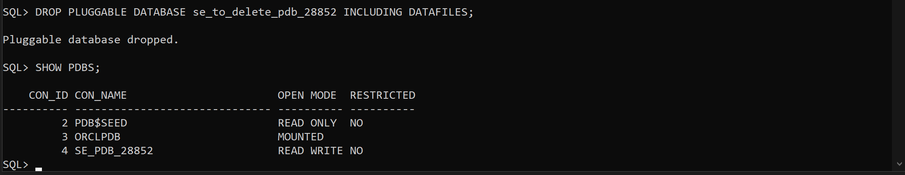

## Task 3: Oracle Entreprise Manager (OEM)

Firstly, it is highly advised to create a connection from our Oracle PDB user to SQL developer.

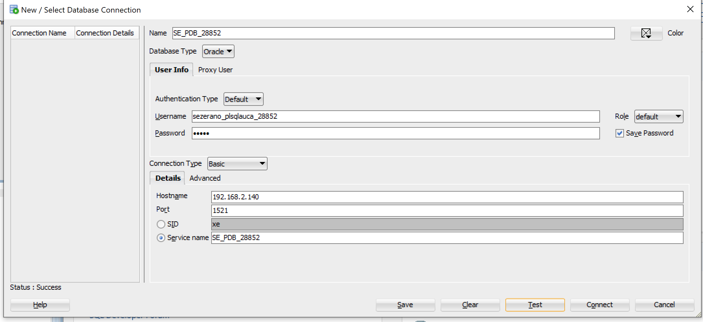

Then open the Oracle Entreprise manager in browser, using: 
```
https//localhost:<oem port>
```
In some cases the ports may differ, so to be sure you are using the correct port, while logged in as sysdba run:
```
SELECT DBMS_XDB_CONFIG.GETHTTPSPORT() FROM DUAL;
```
Then login with the system credentials (the one you set during installation).

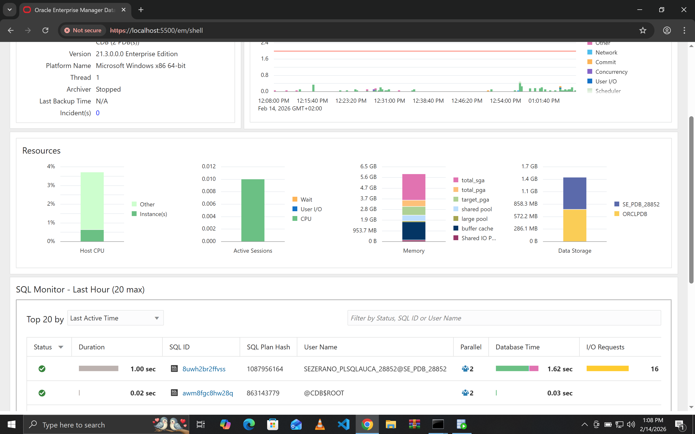

## Challenges encountered
The only challenge encountered was logging in with the PDB user in Oracle Entreprise Manager. The solution to this was using the terminal and also adjusting to the listener to which our PDB was running on.

#
“All sources were properly cited. Implementations and analysis represent original work. No AI generated content was copied without attribution or adaptation.”